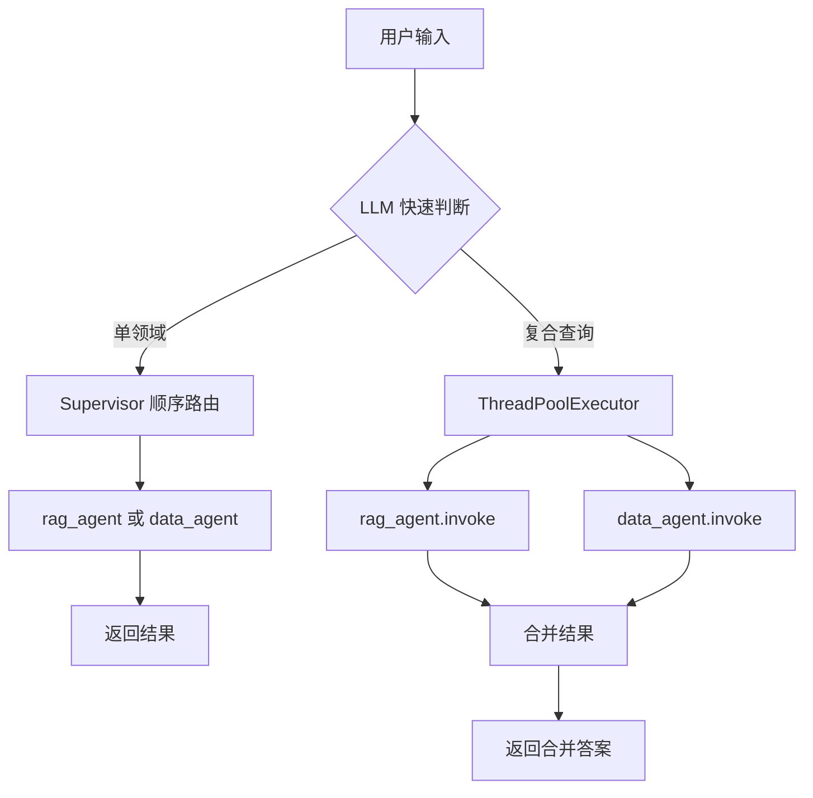

## 产品概述

优化 data_agent 响应速度，目标将复杂复合查询（如"研发中心3月份硬件采购和软件采购详情，以及总结CSMP项目节点安排"）从当前 232s 降至 80-120s，同时保持答案准确度不降低。

## 核心优化方向

### 1. Router 层并行分发（最大收益：省 ~80s）

复合查询同时涉及 data_agent（Excel 统计）和 rag_agent（知识库检索）时，两者无数据依赖，当前串行执行。改为并行分发：Router 识别复合查询后，同时调用两个 agent，等待双方完成后合并结果。

### 2. data_agent 文件缓存（省 ~15s）

`inspect_file` 每次重新调用 `pd.read_excel` 读取同一文件。同一会话内对同一文件路径的 inspect 结果应缓存，后续调用直接返回缓存。

### 3. 缩短代码生成 prompt（省 ~10s）

`execute_data_query` 的 `code_prompt` 当前 ~20 行规则说明，Token 量大导致 LLM 生成耗时。精简为关键约束，减少 30-40% Token。

### 4. Agent prompt 优化（省 ~15s）

引导 agent 最小化工具调用轮数：同一文件只 inspect 一次；明确告知一次 execute 可完成多步统计。

## 技术栈

- Python 3.10+
- LangGraph Supervisor（现有架构不变）
- `concurrent.futures.ThreadPoolExecutor`（标准库，并行分发）
- 闭包内 dict 缓存（文件结构缓存）

## 实现策略

### 策略 A：Router 层并行分发（agent.py）

**核心思路**：在 `chat()` 函数入口处，用 LLM 快速判断是否需要并行分发。如果是复合查询（同时涉及 RAG + Data），用 `ThreadPoolExecutor` 并行调用两个 agent，合并返回值。

**实现细节**：

- 新增 `_is_compound_query(llm, user_input) -> bool` 函数：用轻量 prompt 判断问题是否同时需要知识库和 Excel
- 新增 `_run_agents_parallel()` 函数：并行执行两个 agent.invoke()，收集两路结果
- `chat()` 中增加分支：复合查询走并行路径，单一查询走原 supervisor 路径
- 并行路径的 steps_log 合并两路日志，agent_used 设为 `"rag_agent + data_agent"`
- 并行路径失去流式能力（trade-off：速度换实时性），但仍返回完整答案

**为什么用 ThreadPoolExecutor 而非 asyncio**：

- `agent.invoke()` 是同步阻塞调用（底层 LangGraph 图执行）
- 两个 agent 之间无共享状态，线程安全
- 标准库，无额外依赖

### 策略 B：文件结构缓存（agents/data_agent.py）

**核心思路**：在 `create_data_agent` 闭包内维护一个 `_inspect_cache: dict[str, str]`，key 为 `file_path`，value 为 `inspect_file` 返回结果。同一会话内重复 inspect 同一文件直接返回缓存。

**缓存有效期**：与 `data_agent` 实例生命周期相同（即整个应用运行期间）。如果担心缓存过期（文件被修改），可在 Prompt 中告知 agent：如怀疑数据变化可用 `force_refresh` 参数强制刷新（预留给未来的扩展点）。

### 策略 C：缩短 code_prompt（agents/data_agent.py）

**当前问题**：`code_prompt` 有 16 行规则 + 多文件规则，包含大量冗余解释。LLM 模型生成 Token 数与 prompt Token 数正相关。

**优化方法**：

- 合并重复规则（如扩展名选择规则在当前代码中出现了两次：code_prompt 第3条 + multi_file_rules）
- 去除"请根据需求写 Python 代码"等客套话
- 用紧凑格式：`规则：1. xxx 2. xxx` 替代分条枚举
- 保留所有硬性约束（skiprows、禁止 agent 工具、read_excel/read_csv 选择）

### 策略 D：Agent prompt 减少轮数（agents/data_agent.py）

**当前问题**：Agent prompt 只说工具功能，没说如何高效使用。Agent 可能过度谨慎，逐个文件 inspect、逐个问题 execute。

**优化方法**：新增效率引导：

- "一次 execute_data_query 可完成多个统计需求，合并同类计算"
- "同一文件只 inspect 一次，后续使用已获得的列名和 skiprows"
- "对于多个 Excel 文件，file_path 用逗号分隔一次性传入"

## 架构设计

### 修改后的流程图



### 并行分发数据流

```
chat() 入口
  │
  ├─ _is_compound_query(llm, user_input)  → True
  │
  ├─ ThreadPoolExecutor.submit(rag_agent.invoke, rag_input)
  ├─ ThreadPoolExecutor.submit(data_agent.invoke, data_input)
  │
  ├─ as_completed() 收集两路结果
  │
  ├─ 合并 steps_log (标记来源)
  └─ 拼接 final_answer: "【知识库检索】\n{rag_answer}\n\n【数据统计分析】\n{data_answer}"
```

## 目录结构

```
d:\App_data\HNGD-Agent\HNGD-backend\
├── agent.py                  # [MODIFY] 新增 _is_compound_query() 和 _run_agents_parallel()；chat() 增加并行分支
├── agents/
│   └── data_agent.py         # [MODIFY] 增加 _inspect_cache 缓存；缩短 code_prompt；优化 agent prompt
└── project_documents/
    └── Dev_log.md           # [MODIFY] 记录本次优化
```

## 关键代码结构

### agent.py 新增函数签名

```python
# 判断是否为复合查询（同时需要 RAG + Data）
def _is_compound_query(llm, user_input: str) -> bool:
    """快速判断问题是否需要同时访问知识库和 Excel 数据。"""

# 并行执行两个 agent
def _run_agents_parallel(
    rag_agent, data_agent, user_input: str, config: dict
) -> tuple[str, list, str]:
    """并行调用两个 agent，返回 (merged_answer, merged_steps_log, agent_used)。"""
```

### data_agent.py 缓存结构

```python
def create_data_agent(llm):
    # 文件结构缓存：同一会话内避免重复读取 Excel
    _inspect_cache: dict[str, str] = {}
    
    @tool
    def inspect_file(file_path: str) -> str:
        if file_path in _inspect_cache:
            return _inspect_cache[file_path]
        result = _do_inspect(file_path)
        _inspect_cache[file_path] = result
        return result
```